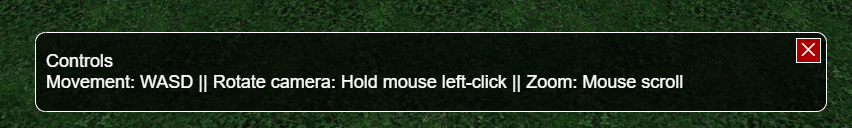

# GUI Components list

## Panel

Base GUI component, can contain al other types of components

## Helper

Is a floating panel with only a close button. Should be used to show information/warnings to the player.

Example:

